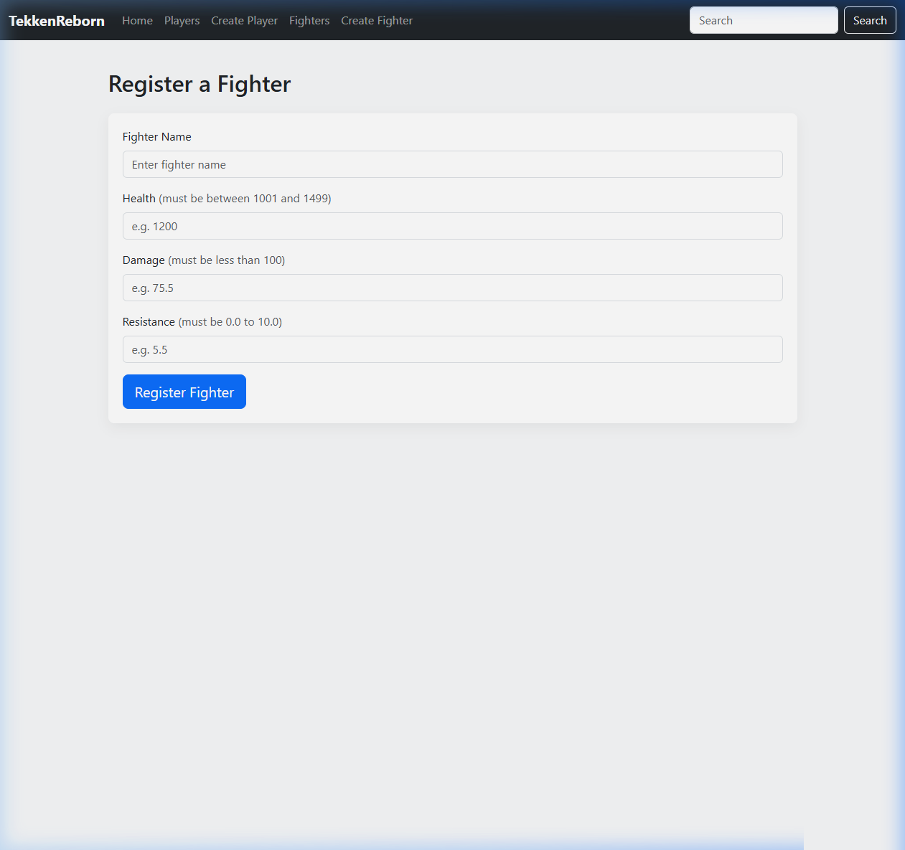
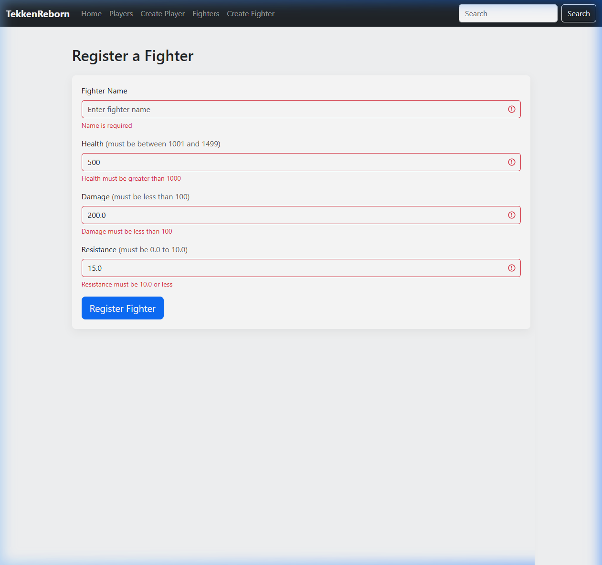
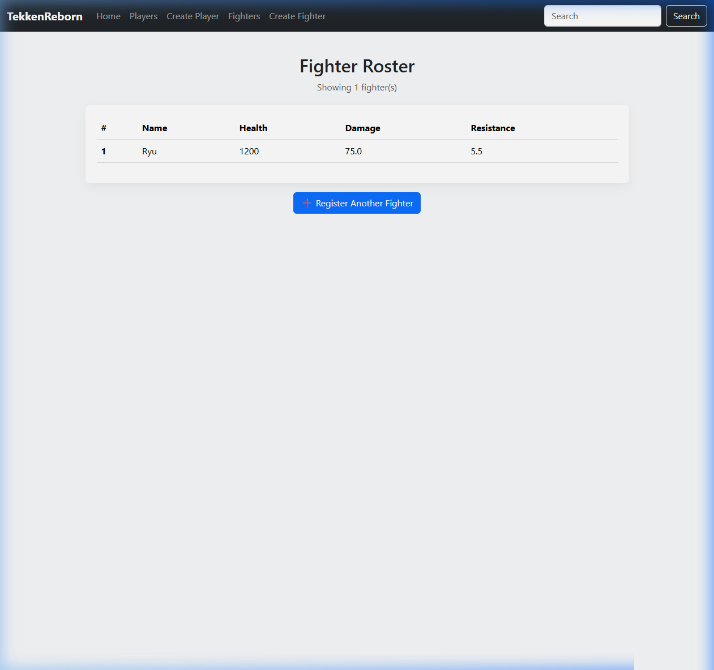
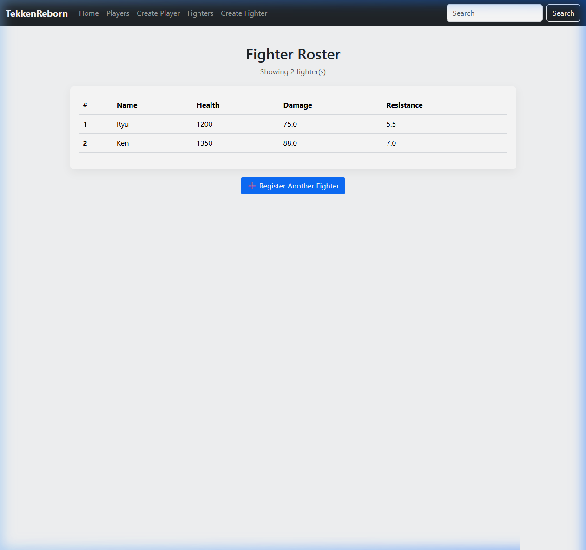

# Lab 2 — Thymeleaf Post Method
**Course:** CPAN 228 — Web Application Development
**Student:** Harry Joseph

---

## Overview

This lab builds a fighter registration system using Spring Boot and Thymeleaf. Users fill out a form to register a fighter, which gets validated on the server and then added to an in-memory list. The roster of registered fighters is displayed in a separate table view.

---

## Registration Form

The form collects four fields: name, health, damage, and resistance. Each field has a hint showing the accepted range.

---

## Validation

When invalid data is submitted, the server returns the form with error messages displayed under each failing field. The fighter is not added to the pool until all fields pass validation.

---

## Fighter Added to Roster

After submitting valid data, the server redirects to the fighters page where the new entry appears in the table.

---

## Multiple Fighters Registered

Additional fighters can be registered and all entries accumulate in the same table.

---

## Validation Rules

| Field      | Rule                            |
|------------|---------------------------------|
| Name       | Cannot be empty                 |
| Health     | Must be between 1001 and 1499   |
| Damage     | Must be less than 100           |
| Resistance | Must be a decimal from 0 to 10  |

---

---

## Pull Request

Pull request submitted to the course repository for review.

[https://github.com/Christin-Classrooms/Week-4-Thymeleaf-Post-Method/pull/53](https://github.com/Christin-Classrooms/Week-4-Thymeleaf-Post-Method/pull/53)

